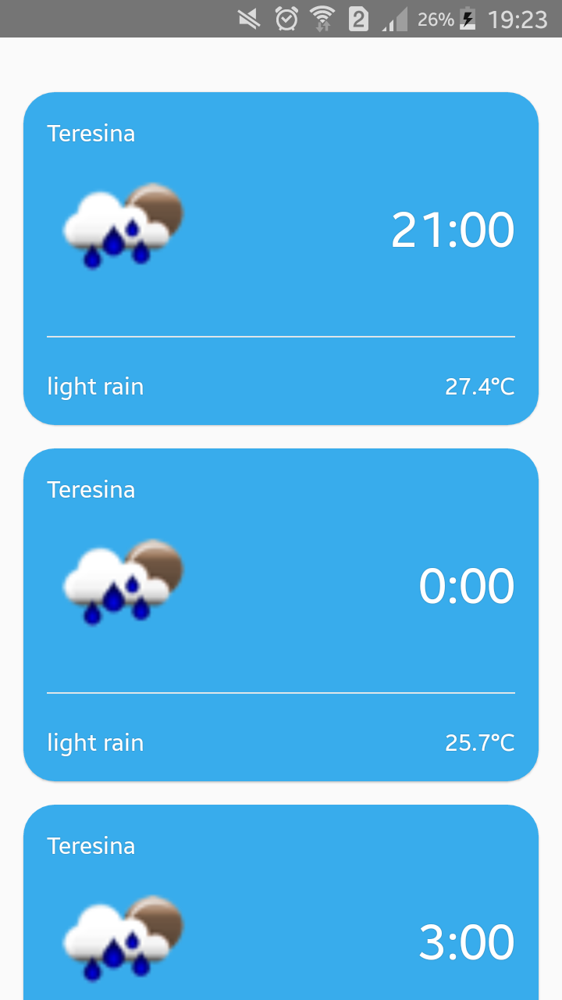

## Aplicativo criado para usa a funcionalidade Geolocation de um celular para obter a localização de um usuário e passar a latitude e a longitude do local para a API Weather do Weather Map, que nos dará uma previsão do tempo de 5 dias (dividido em 3 pedaços de horas) para o local do usuário.

